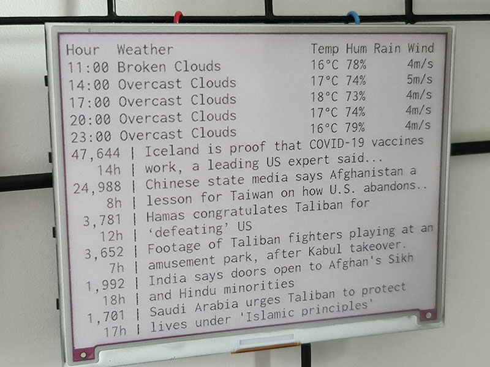

# Dashy

A way to connect different sources to different destinations. An example is
combining a news source with a weather source into a png destination. What this
means is that we can take the current weather forecast for the next few days
and the current top news today, join them together and export into a png file.

This png file can then be displayed on a screen.

An output example, using /r/worldnews from reddit plus openweathermap for
weather, would look like this:

```
Hour  Weather                  Temp Hum Rain Wind 
11:00 Broken Clouds            16°C 78%      4m/s 
14:00 Overcast Clouds          17°C 74%      5m/s 
17:00 Overcast Clouds          18°C 73%      4m/s 
20:00 Overcast Clouds          17°C 74%      4m/s 
23:00 Overcast Clouds          16°C 79%      4m/s 
47,652 | Iceland is proof that COVID-19 vaccines
   14h | work, a leading US expert said...
25,095 | Chinese state media says Afghanistan a
    8h | lesson for Taiwan on how U.S. abandons..
 3,787 | Hamas congratulates Taliban for
   12h | ‘defeating’ US
 3,662 | Footage of Taliban fighters playing at an
    7h | amusement park, after Kabul takeover.
 1,990 | India says doors open to Afghan's Sikh
   18h | and Hindu minorities
 1,702 | Saudi Arabia urges Taliban to protect
   17h | lives under 'Islamic principles'
```

which is then output to a Inky Impression screen:

<div align="center">
  
</div>

# Usage

An example of how the preview above was created:

```python
import os

from dashy.destinations.png import generate_png
from dashy.sources.openweathermap.weather import Weather
from dashy.sources.reddit.worldnews import WorldNews

MAX_WIDTH = 50
FONT_SIZE = 24
MAX_STORY_LINES = 2

if __name__ == "__main__":
    weather = Weather(
        max_width=MAX_WIDTH,
        max_lines=6,
        lat=os.environ["OPENWEATHERMAP_LAT"],
        lon=os.environ["OPENWEATHERMAP_LON"],
        api_key=os.environ["OPENWEATHERMAP_API_KEY"],
    )

    news = WorldNews(max_width=MAX_WIDTH, max_lines=12, max_story_lines=MAX_STORY_LINES)

    generate_png(
        list(weather.get_lines()) + list(news.get_lines()),
        font_size=FONT_SIZE,
        margin=0,
    )

    # Then using the Inky library from Pimoroni
    # image = Image.open('out.png')
    # inky.set_image(image, saturation=0.5)
    # inky.show()
```


# Installation

As the target platform for me is a Raspberry Pi Zero, installing PIL/Pillow is
easiest done by installing it natively, so it's an optional dependency for
Dashy. 

Installing the package from a wheel is as simple as just 

```bash
pip install 'dashy-0.1.2-py3-none-any-whl'
```

and to include the pillow dependency


```bash
pip install 'dashy-0.1.2-py3-none-any-whl[pillow]'
```
